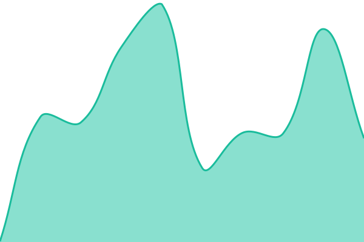
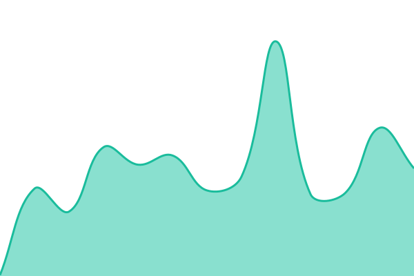
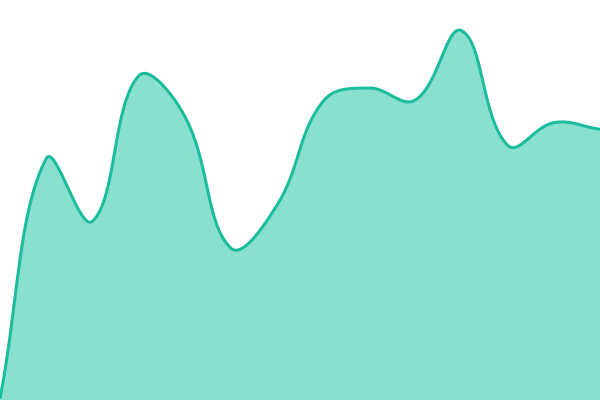

# [📈 Live Status](https://0xPufferFish.github.io/fuguform-status): <!--live status--> **Semua layanan berjalan normal**

This repository contains the open-source uptime monitor and status page for [0xPufferFish](https://0xPufferFish.github.io/fuguform-status), powered by [Upptime](https://github.com/upptime/upptime).

With [Upptime](https://upptime.js.org), you can get your own unlimited and free uptime monitor and status page, powered entirely by a GitHub repository. We use [Issues](https://github.com/0xPufferFish/fuguform-status/issues) as incident reports, [Actions](https://github.com/0xPufferFish/fuguform-status/actions) as uptime monitors, and [Pages](https://0xPufferFish.github.io/fuguform-status) for the status page.

<!--start: status pages-->
<!-- This summary is generated by Upptime (https://github.com/upptime/upptime) -->
<!-- Do not edit this manually, your changes will be overwritten -->
<!-- prettier-ignore -->
| URL | Status | History | Response Time | Uptime |
| --- | ------ | ------- | ------------- | ------ |
|  [API](https://app.fuguform.com/api/health) | Aktif | [api.yml](https://github.com/0xPufferFish/fuguform-status/commits/HEAD/history/api.yml) | 

 249 ms
     
 | 

<a href="https://0xPufferFish.github.io/fuguform-status/history/api">100.00%</a>
    

|  [Builder](https://app.fuguform.com/masuk) | Aktif | [builder.yml](https://github.com/0xPufferFish/fuguform-status/commits/HEAD/history/builder.yml) | 

 152 ms
     
 | 

<a href="https://0xPufferFish.github.io/fuguform-status/history/builder">100.00%</a>
    

|  [fuguform.com](https://fuguform.com/) | Aktif | [fuguform-com.yml](https://github.com/0xPufferFish/fuguform-status/commits/HEAD/history/fuguform-com.yml) | 

 228 ms
     
 | 

<a href="https://0xPufferFish.github.io/fuguform-status/history/fuguform-com">100.00%</a>
    

|  [Tenant page (DuckDive)](https://duckdive.fuguform.com/) | Aktif | [tenant-page-duck-dive.yml](https://github.com/0xPufferFish/fuguform-status/commits/HEAD/history/tenant-page-duck-dive.yml) | 

 447 ms
     
 | 

<a href="https://0xPufferFish.github.io/fuguform-status/history/tenant-page-duck-dive">100.00%</a>
    

<!--end: status pages-->

[**Visit our status website →**](https://0xPufferFish.github.io/fuguform-status)

## 📄 License

- Powered by: [Upptime](https://github.com/upptime/upptime)
- Code: [MIT](./LICENSE) © [Anand Chowdhary](https://anandchowdhary.com)
- Data in the `./history` directory: [Open Database License](https://opendatacommons.org/licenses/odbl/1-0/)
